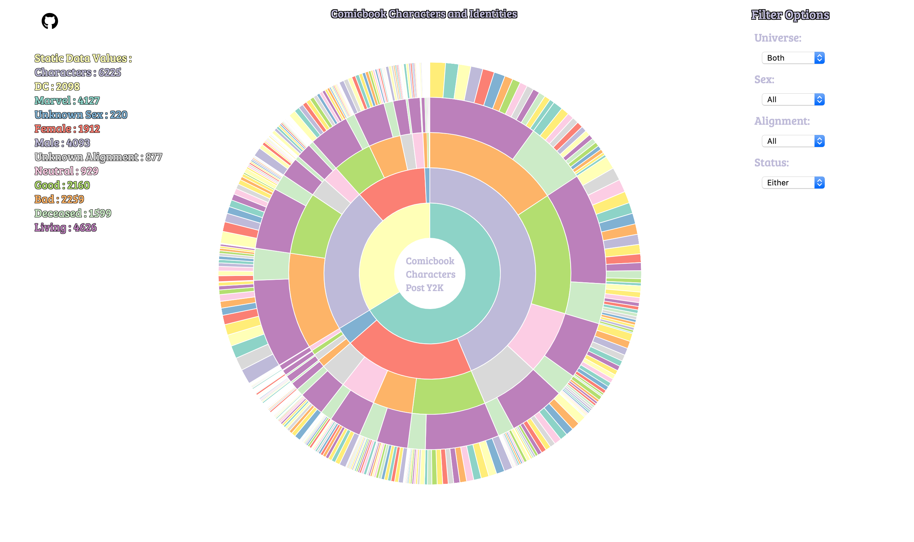
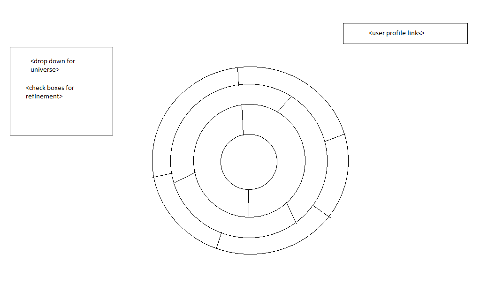

# DataHero

## Background and Overview

DataHero is a data visualization of comic book characters from both the DC and Marvel universe.

## MVPs

- See an overview of the number of characters per universe and their attributes
- Users can switch between both universes, DC only or Marvel only
- Users can refine the search through their atrtributes => [sex, alive, identity, alignment, first year appearance]
- Users can apply multiple refinements

## Bonus MVP

- Along with the graph there is a table breakdown of the graph
- There is a table showing the results of each render that has all characters and their attributes

## Data

This data is from [fivethirtyeight](https://github.com/fivethirtyeight/data/tree/master/comic-characters) as `(*.csv)` files

## Wireframe

- User profile links to this repo
- The dropdown decides which universe of characters you are looking at
- The checkboxes limit the amount of characters you see by that attribute
- Doughtnut chart will shift with selecitons from the left side of the page
- Hovering on a section of the doughtnut will give you a label with something like: `good:300` or `evil:200`

## Technologies

- `Javascript`
- `d3js`
- `Webpack`
